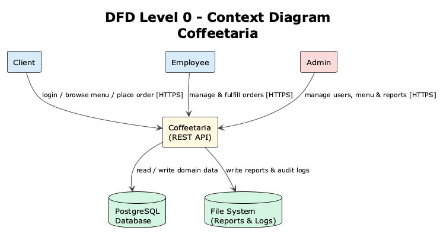
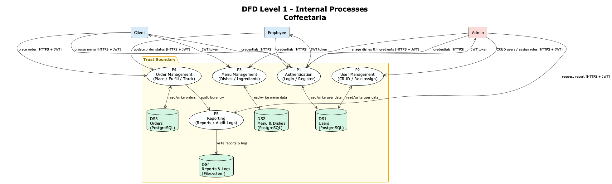

# Design – Coffeetaria

---

## 1. System Overview & Architecture

Coffeetaria is a backend REST API application following a layered architecture based on Domain-Driven Design (DDD). It exposes HTTP endpoints consumed by clients (web/mobile frontends or direct API consumers) and persists data in a relational database. The system also interacts with the server filesystem for report generation and audit logging.

### 1.1 Architectural Layers

> [`diagrams/src/architecture.puml`](./diagrams/src/architecture.puml) · [`diagrams/img/Architecture_Coffeetaria.png`](./diagrams/img/Architecture_Coffeetaria.png)

| Layer | Responsibility |
|-------|---------------|
| API / Controller | HTTP request handling, input validation, authentication enforcement |
| Application | Use cases, orchestration, authorization checks |
| Domain | Aggregates, entities, value objects, domain business rules |
| Infrastructure | Database (ORM), filesystem access, external services |

### 1.2 Technology Stack

| Component | Technology |
|-----------|------------|
| Language | Java 21 |
| Framework | Spring Boot 3 |
| Database | PostgreSQL |
| Authentication | JWT (RS256) |
| Containerization | Docker / Docker Compose |
| Build tool | Maven |

### 1.3 System Components

| Component | Description |
|-----------|-------------|
| REST API | Exposes all business operations as HTTP endpoints |
| Auth Module | Handles registration, login, JWT issuance and validation |
| User Module | Manages user accounts and role assignments |
| Menu Module | Manages ingredients, dishes, and daily menus |
| Order Module | Handles order lifecycle from placement to delivery |
| Report Module | Generates daily sales reports written to the filesystem |
| Audit Logger | Writes security and order events to append-only log files |

---

## 2. Domain Model

The domain is organized into three aggregates following DDD principles.

| Aggregate | Source | Image |
|-----------|--------|-------|
| User | [`src/domain_user.puml`](./diagrams/src/domain_user.puml) | [`img/Domain_User_Aggregate.png`](./diagrams/img/Domain_User_Aggregate.png) |
| Menu | [`src/domain_menu.puml`](./diagrams/src/domain_menu.puml) | [`img/Domain_Menu_Aggregate.png`](./diagrams/img/Domain_Menu_Aggregate.png) |
| Purchase | [`src/domain_purchase.puml`](./diagrams/src/domain_purchase.puml) | [`img/Domain_Purchase_Aggregate.png`](./diagrams/img/Domain_Purchase_Aggregate.png) |

### Aggregates Summary

| Aggregate | Root | Entities | Value Objects |
|-----------|------|----------|---------------|
| User | `User` | — | `UserType` |
| Menu | `Menu` | `Dish`, `Ingredient` | `Name`, `IngredientType`, `Allergen` |
| Purchase | `Purchase` | — | — |

**Roles:** `CLIENT` · `EMPLOYEE` · `ADMIN`

**Order lifecycle:** `PENDING` → `PREPARING` → `READY` → `DELIVERED`

---

## 3. Data Flow Diagrams

### 3.1 DFD Level 0 – Context Diagram

> **Diagram:** [`diagrams/src/dfd_level0.puml`](./diagrams/src/dfd_level0.puml)



**Trust Boundaries:**
- All external entities (Client, Employee, Admin) are **outside** the trust boundary
- The system trusts only requests bearing a valid signed JWT
- The filesystem and database are **inside** the trust boundary (internal infrastructure)

---

### 3.2 DFD Level 1 – Internal Processes

> **Diagram:** [`diagrams/src/dfd_level1.puml`](./diagrams/src/dfd_level1.puml)



**Processes:**

| ID | Process | Description |
|----|---------|-------------|
| P1 | Authentication | Login, registration, JWT issuance and validation |
| P2 | User Management | CRUD user accounts, role assignment (Admin only) |
| P3 | Menu Management | Manage dishes, ingredients and daily menu publication |
| P4 | Order Management | Place orders (Client), fulfill and track orders (Employee) |
| P5 | Reporting | Generate sales reports and write audit log entries to filesystem |

**Data Stores:**

| ID | Store | Technology |
|----|-------|------------|
| DS1 | Users | PostgreSQL |
| DS2 | Menu, Dishes, Ingredients | PostgreSQL |
| DS3 | Orders | PostgreSQL |
| DS4 | Reports & Audit Logs | Filesystem |

**Data Flows:**

| Flow | From | To | Data | Protocol |
|------|------|----|------|----------|
| F1 | Client / Employee / Admin | P1. Auth | Credentials (email, password) | HTTPS |
| F2 | P1. Auth | Client / Employee / Admin | JWT Access Token | HTTPS |
| F3 | Client | P3. Menu Mgmt | Browse menu request | HTTPS + JWT |
| F4 | Client | P4. Order Mgmt | Order placement (dish IDs, quantities) | HTTPS + JWT |
| F5 | Employee | P4. Order Mgmt | Order status update | HTTPS + JWT |
| F6 | Admin | P2. User Mgmt | User CRUD, role assignment | HTTPS + JWT |
| F7 | Admin | P3. Menu Mgmt | Dish / ingredient management | HTTPS + JWT |
| F8 | Admin | P5. Reporting | Report generation request | HTTPS + JWT |
| F9 | P4. Order Mgmt | DS4. File System | Audit log entries (append-only) | Internal |
| F10 | P5. Reporting | DS4. File System | Daily sales report (write) | Internal |

### 3.3 DFD Level 2 – P5 Reporting Process

The Reporting process interacts with the filesystem and multiple data stores, making it the highest-risk process in terms of path traversal, information disclosure, and audit trail integrity. A Level 2 decomposition is therefore justified.

> **Diagram:** [`diagrams/src/dfd_level2_reporting.puml`](./diagrams/src/dfd_level2_reporting.puml)

**Sub-processes:**

| ID | Sub-process | Description |
|----|-------------|-------------|
| P5.1 | Authorise Request | Validates the JWT and confirms the caller holds the `ADMIN` role |
| P5.2 | Validate Parameters | Enforces date-range bounds and validates the filename against an allowlist pattern (`^[a-zA-Z0-9_\-]+\.csv$`) |
| P5.3 | Query Order Data | Reads order records from DS3 for the validated date range |
| P5.4 | Format Report (CSV) | Aggregates and serialises order data into CSV; triggers the audit event |
| P5.5 | Write Report File | Resolves the canonical path, confirms it is within the reports directory, writes with permissions `600` |
| P5.6 | Log Audit Event | Appends an entry to DS4 (audit log) recording actor `sub`, IP, timestamp, date range, and output filename |

**Trust boundary note:** All sub-processes are inside the trust boundary. The Admin is the only external entity. DS1 is read only to validate the JWT role; DS3 is read-only for order data; DS4 is write-only (append) for both the report file and the audit log.

**Key data flows:**

| Flow | From | To | Data |
|------|------|----|------|
| F-R1 | Admin | P5.1 | JWT + date range + filename [HTTPS] |
| F-R2 | P5.1 | DS1 | Read user role for JWT validation |
| F-R3 | P5.1 | P5.2 | Validated identity + raw params |
| F-R4 | P5.2 | P5.3 | Sanitised query params |
| F-R5 | P5.3 | DS3 | Read orders for date range |
| F-R6 | P5.3 | P5.4 | Raw order records |
| F-R7 | P5.4 | P5.5 | Formatted CSV content |
| F-R8 | P5.4 | P5.6 | Audit event (actor, params, filename) |
| F-R9 | P5.5 | DS4 | Write report file (restricted path, perms 600) |
| F-R10 | P5.6 | DS4 | Append audit log entry |
| F-R11 | P5.5 | Admin | HTTP 200 + confirmed filename [HTTPS] |

---

## 4. Database Schema

> [`diagrams/src/db_schema.puml`](./diagrams/src/db_schema.puml) · [`diagrams/img/DB_Schema_Coffeetaria.png`](./diagrams/img/DB_Schema_Coffeetaria.png)

| Table | Description |
|-------|-------------|
| `users` | User accounts with role and optional pre-paid balance |
| `dishes` | Cafeteria dishes with name and price |
| `ingredients` | Ingredients with type and allergen classification |
| `dish_ingredients` | Many-to-many join between dishes and ingredients |
| `menus` | Daily menus with references to meat, fish and vegetarian dishes |
| `purchases` | Client purchase records linking user, dish and date |

---

## 5. Authentication Flow

> [`diagrams/src/auth_flow.puml`](./diagrams/src/auth_flow.puml) · [`diagrams/img/Auth_Flow_Coffeetaria.png`](./diagrams/img/Auth_Flow_Coffeetaria.png)

---

## 6. API Design

### 6.1 Authentication

| Method | Endpoint | Auth | Roles | Description |
|--------|----------|------|-------|-------------|
| POST | `/api/auth/login` | None | Public | Authenticate with email + password; returns JWT |
| POST | `/api/auth/register` | None | Public | Register a new user account (default role: CLIENT) |

### 6.2 User Management

| Method | Endpoint | Auth | Roles | Description |
|--------|----------|------|-------|-------------|
| GET | `/api/users` | JWT | ADMIN | List all users |
| GET | `/api/users/{id}` | JWT | ADMIN | Get user by ID |
| GET | `/api/users/by-username/{username}` | JWT | ADMIN | Get user by username |
| POST | `/api/users` | JWT | ADMIN | Create a new user |
| PUT | `/api/users/{id}` | JWT | ADMIN | Update user by ID |
| DELETE | `/api/users/{id}` | JWT | ADMIN | Delete user by ID |
| GET | `/api/users/me` | JWT | ADMIN, CLIENT | Get own profile |
| PUT | `/api/users/me` | JWT | ADMIN, CLIENT | Update own profile |

### 6.3 Dish Management

| Method | Endpoint | Auth | Roles | Description |
|--------|----------|------|-------|-------------|
| GET | `/api/dishes` | JWT | ADMIN, EMPLOYEE, CLIENT | List all dishes |
| GET | `/api/dishes/{id}` | JWT | ADMIN, EMPLOYEE, CLIENT | Get dish by ID |
| POST | `/api/dishes` | JWT | ADMIN, EMPLOYEE | Create a new dish |
| PUT | `/api/dishes/{id}` | JWT | ADMIN, EMPLOYEE | Update dish by ID |
| DELETE | `/api/dishes/{id}` | JWT | ADMIN, EMPLOYEE | Delete dish by ID |

### 6.4 Ingredient Management

| Method | Endpoint | Auth | Roles | Description |
|--------|----------|------|-------|-------------|
| GET | `/api/ingredients` | JWT | ADMIN, EMPLOYEE, CLIENT | List all ingredients |
| GET | `/api/ingredients/{id}` | JWT | ADMIN, EMPLOYEE, CLIENT | Get ingredient by ID |
| POST | `/api/ingredients` | JWT | ADMIN, EMPLOYEE | Create a new ingredient |
| PUT | `/api/ingredients/{id}` | JWT | ADMIN, EMPLOYEE | Update ingredient by ID |
| DELETE | `/api/ingredients/{id}` | JWT | ADMIN, EMPLOYEE | Delete ingredient by ID |

### 6.5 Menu Management

| Method | Endpoint | Auth | Roles | Description |
|--------|----------|------|-------|-------------|
| GET | `/api/menus` | JWT | ADMIN, EMPLOYEE, CLIENT | List all menus |
| GET | `/api/menus/{id}` | JWT | ADMIN, EMPLOYEE, CLIENT | Get menu by ID |
| GET | `/api/menus/by-date/{date}` | JWT | ADMIN, EMPLOYEE, CLIENT | Get menu by date |
| POST | `/api/menus` | JWT | ADMIN, EMPLOYEE¹ | Create/publish a menu |
| PUT | `/api/menus/{id}` | JWT | ADMIN, EMPLOYEE | Update menu by ID |
| DELETE | `/api/menus/{id}` | JWT | ADMIN, EMPLOYEE | Delete menu by ID |

> ¹ EMPLOYEE can only publish menus for future dates (`@PreAuthorize` constraint)

### 6.6 Purchase Management

| Method | Endpoint | Auth | Roles | Description |
|--------|----------|------|-------|-------------|
| GET | `/api/purchases` | JWT | ADMIN, CLIENT | List purchases |
| GET | `/api/purchases/{id}` | JWT | ADMIN, CLIENT | Get purchase by ID |
| GET | `/api/purchases/by-client/{clientId}` | JWT | ADMIN, CLIENT | List purchases by client |
| GET | `/api/purchases/client/{clientId}` | JWT | ADMIN, CLIENT | List purchases by client (alt) |
| GET | `/api/purchases/date/{date}` | JWT | ADMIN, CLIENT | List purchases by date |
| POST | `/api/purchases` | JWT | ADMIN, CLIENT | Place a new purchase/order |
| PUT | `/api/purchases/{id}` | JWT | ADMIN, CLIENT | Update purchase by ID |
| DELETE | `/api/purchases/{id}` | JWT | ADMIN, CLIENT | Delete purchase by ID |

### 6.7 Authentication Flow

```
Client                        API
  │                            │
  │── POST /api/auth/login ───▶│
  │   { email, password }      │  1. Validate credentials
  │                            │  2. Issue JWT (RS256, exp: 1h)
  │◀── 200 { token: "..." } ───│
  │                            │
  │── GET /api/menus           │
  │   Authorization: Bearer …  │  3. Validate JWT signature + expiry
  │                            │  4. Extract role from claims
  │◀── 200 [ menus... ] ───────│  5. Enforce role-based access
```

---

## 7. Secure Design Decisions

| Decision | Rationale |
|----------|-----------|
| JWT with RS256 (asymmetric) | Private key signs tokens; public key verifies — compromise of the API does not expose signing capability |
| JWT token revocation via version counter | Each user record stores a `tokenVersion` integer; the JWT payload includes this value. On logout or account deactivation, the server increments `tokenVersion` in PostgreSQL. All subsequent requests with the old version are rejected — no external cache required |
| Role enforcement at service layer | Authorization checks in the domain/application layer, not only at the HTTP route level (defense in depth) |
| Parameterized queries via ORM | Eliminates SQL injection at the persistence layer |
| Append-only audit log | Logs written by the application cannot be modified; tampering requires OS-level access |
| Reports in isolated directory | File output restricted to a dedicated path; user-supplied filenames validated against an allowlist pattern |
| Passwords hashed with Bcrypt (cost ≥ 12) | Adaptive hashing resists brute-force even if the database is exfiltrated |
| Environment-based secrets | Database credentials and JWT keys loaded from environment variables; never hardcoded |
| HTTPS enforced at entry point | All plaintext HTTP connections rejected or redirected at the reverse proxy level |
| Minimal OS permissions | Application process runs as a non-root user with access only to its working directory |

---

## 8. Secure Coding Guidelines

These guidelines are mandatory for all contributors. They translate the secure design decisions and SDRs into day-to-day coding rules.

### 8.1 Input Validation

| Rule | Implementation |
|------|---------------|
| Validate all incoming request bodies | Annotate DTOs with `@Valid`; use `@NotNull`, `@Size`, `@Pattern` constraints; reject requests that fail validation with HTTP 400 |
| Use strict allowlists for string fields | Email, username, dish name, and filename fields must match defined regex patterns; reject anything outside the allowlist |
| Never trust client-supplied IDs for ownership | Always resolve the resource owner from the JWT `sub` claim, not from a field in the request body |
| Validate numeric ranges explicitly | Order quantities, prices, and date ranges must be within business-defined bounds; reject negative or zero values where meaningless |

### 8.2 Authentication & Authorization

| Rule | Implementation |
|------|---------------|
| Enforce roles at the service layer | Use `@PreAuthorize` or explicit role checks in service methods — never rely solely on route-level filters |
| Extract user identity from the JWT only | Never read `userId` or `role` from the request body or query parameters; always use `SecurityContextHolder` |
| Reject tokens without a valid signature | Configure Spring Security to refuse `alg: none` and non-RS256 algorithms explicitly |
| Log all authorization failures | Every HTTP 401 and HTTP 403 response must produce a structured log entry with IP, endpoint, and JWT `sub` (if available) |

### 8.3 Data Handling & Output

| Rule | Implementation |
|------|---------------|
| Never return domain entities directly | All responses must go through response DTOs; entities must never be serialized into API responses |
| Exclude sensitive fields from all DTOs | `passwordHash`, internal tokens, and balance fields must not appear in any response DTO |
| Use generic error messages externally | Return `"Invalid credentials"` or `"Access denied"` — never `"User not found"` or stack traces |
| Apply `Cache-Control: no-store` on sensitive endpoints | Authentication, user profile, and order endpoints must not be cached by intermediaries |

### 8.4 File System Operations

| Rule | Implementation |
|------|---------------|
| Never concatenate user input into file paths | Always use `Paths.get(BASE_DIR).resolve(filename).normalize()` and verify the result still starts with `BASE_DIR` |
| Validate filenames against an allowlist | Reject any filename that does not match `^[a-zA-Z0-9_\-]+\.csv$` before resolving the path |
| Set file permissions to 600 on creation | Use `Files.setPosixFilePermissions` (or equivalent) immediately after writing report files |
| Never pass user input to OS commands | Shell commands and process builders must use hardcoded arguments; no user-supplied data reaches the command line |

### 8.5 Logging & Secrets

| Rule | Implementation |
|------|---------------|
| Never log sensitive fields | Passwords, JWT tokens, and PII (email, full name) must be explicitly excluded from log statements; use `@JsonIgnore` or manual filtering |
| Use structured logging | Every log entry must include: `timestamp`, `level`, `userId` (JWT `sub`), `action`, `resource`, `ip`; use a logging framework with MDC |
| Load all secrets from environment variables | JWT private key, database URL, and credentials must come from `System.getenv()`; hardcoded values in any config file are forbidden |
| Use a pre-commit hook to scan for secrets | Configure `gitleaks` or `truffleHog` to block commits containing patterns matching private keys, passwords, or API tokens |

### 8.6 Dependency Management

| Rule | Implementation |
|------|---------------|
| Pin all dependency versions in `pom.xml` | Do not use version ranges (`[1.0,2.0)`); specify exact versions for all direct dependencies |
| Run SCA on every build | OWASP Dependency-Check must be integrated in the Maven build; builds with HIGH or CRITICAL CVEs must fail |
| Review before adding a new dependency | Check the library's last release date, open CVEs, and download count before inclusion; prefer Spring ecosystem libraries |

---

## 9. Dependency Analysis

The following table lists the project dependencies declared in `pom.xml`, the rationale for their selection, and their security posture as of Phase 1.

### 9.1 Core Framework

| Dependency | Version | Purpose | Security Notes |
|------------|---------|---------|----------------|
| `spring-boot-starter-parent` | **3.1.5** | Parent BOM; manages all Spring dependency versions | Actively maintained; pins transitive dependency versions to a tested, compatible set; reduces supply-chain risk |
| `spring-boot-starter-web` | 3.1.5 (via parent) | REST API framework, embedded Tomcat | Ships with Tomcat 10.1.x; configures HTTPS redirect and rejects HTTP by default when a keystore is provided |
| `spring-boot-starter-data-jpa` | 3.1.5 (via parent) | ORM persistence via Hibernate 6 | Uses parameterized queries by default (SDR08); prevents SQL injection at the persistence layer |
| `spring-boot-starter-validation` | 3.1.5 (via parent) | Bean Validation (JSR-380) via Hibernate Validator | Enforces `@Valid` constraints on DTOs; rejects malformed input at the API boundary (SDR06) |
| `spring-boot-starter-security` | 3.1.5 (via parent) | Authentication, authorization, security filters | Provides JWT filter integration, BCrypt support, and method-level `@PreAuthorize` (SDR01, SDR02) |
| `spring-boot-starter-actuator` | 3.1.5 (via parent) | Health and metrics endpoints | Endpoints are secured by default; exposes only `/health` publicly; useful for monitoring (NFR13) |

### 9.2 Authentication

| Dependency | Version | Purpose | Security Notes |
|------------|---------|---------|----------------|
| `jjwt-api` / `jjwt-impl` / `jjwt-jackson` | **0.11.5** | JWT creation and validation | Pinned to 0.11.5; supports HMAC-SHA and RSA signing algorithms; rejects `alg: none` tokens by default (SDR01, SDR03) |
| `spring-security-crypto` (transitive) | 6.1.x (via parent) | BCrypt password hashing | Included via Spring Security; cost factor configured to ≥ 12 at application level (SDR02, NFR02) |

### 9.3 Database

| Dependency | Version | Purpose | Security Notes |
|------------|---------|---------|----------------|
| `h2` | managed by parent (runtime) | In-memory database for development and testing | Scope `runtime`; not exposed in production builds; replaced by PostgreSQL in production deployment (SDR18) |
| PostgreSQL JDBC driver | planned for Sprint 1 | Production database connectivity | To be added in Phase 2; credentials will be loaded from environment variables (SDR18) |

### 9.4 Utilities & API Documentation

| Dependency | Version | Purpose | Security Notes |
|------------|---------|---------|----------------|
| `modelmapper` | **3.1.1** | DTO ↔ entity mapping | Used only for non-sensitive field projection; response DTOs exclude all sensitive fields (SDR09) |
| `springdoc-openapi-starter-webmvc-ui` | **2.3.0** | OpenAPI / Swagger UI | Documentation endpoint; must be disabled or access-controlled in production to avoid API enumeration |

### 9.5 Testing

| Dependency | Version | Purpose | Security Notes |
|------------|---------|---------|----------------|
| `spring-boot-starter-test` | 3.1.5 (via parent) | Unit and integration testing (JUnit 5, Mockito, Spring Test) | Includes Spring Security Test for role-based test scenarios |
| `junit-jupiter` | **5.10.0** | JUnit 5 test engine | Pinned explicitly to ensure compatibility with ArchUnit and PITest |
| `archunit-junit5` | **1.4.1** | Architecture fitness tests | Enforces layered architecture constraints; ensures no infrastructure code leaks into the domain layer (NFR10, NFR11) |

### 9.6 Build & Quality Plugins

| Plugin | Version | Purpose | Security Notes |
|--------|---------|---------|----------------|
| `spring-boot-maven-plugin` | 3.1.5 (via parent) | Executable JAR packaging | Produces a self-contained artifact; no external servlet container required |
| `jacoco-maven-plugin` | **0.8.14** | Code coverage measurement | Coverage reports generated on `mvn verify`; baseline for identifying untested security-critical paths |
| `pitest-maven` | **1.15.0** | Mutation testing | Validates test quality by injecting code mutations; scoped to Purchase aggregate for Phase 1 |
| OWASP `dependency-check-maven` | planned for Sprint 1 | Software Composition Analysis (SCA) | To be integrated in Phase 2 CI pipeline; will block builds on HIGH/CRITICAL CVEs (SDR23) |
| `spotbugs-maven-plugin` | planned for Sprint 1 | Static Application Security Testing (SAST) | To be integrated in Phase 2 CI pipeline; detects injection flaws and insecure patterns (SDR23) |

### 9.7 Dependency Security Policy

- All direct dependency versions are pinned to exact versions in `pom.xml`; Spring Boot parent BOM manages transitive versions.
- H2 is scoped to `runtime` and is not included in production builds.
- The Springdoc Swagger UI endpoint (`/swagger-ui.html`) must be disabled or protected before production deployment.
- OWASP Dependency-Check and SpotBugs will be integrated in Phase 2 Sprint 1 as part of the CI security pipeline (SDR23, TC23).
- Any dependency introducing a HIGH or CRITICAL CVE must be patched or have an accepted exception documented before merging.
